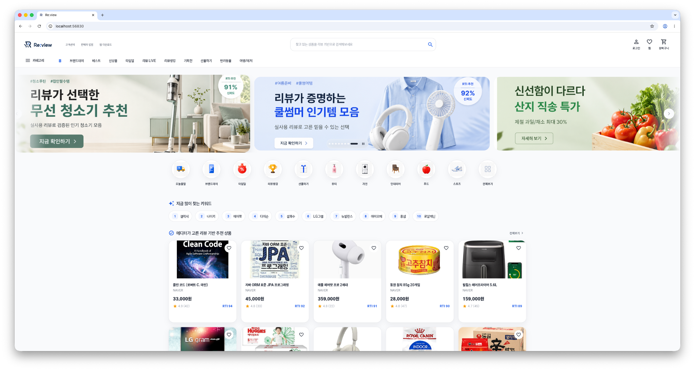
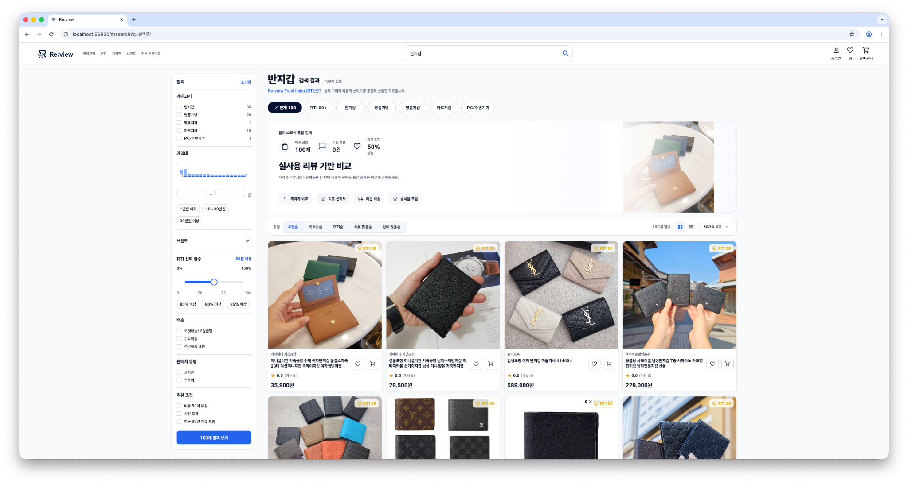
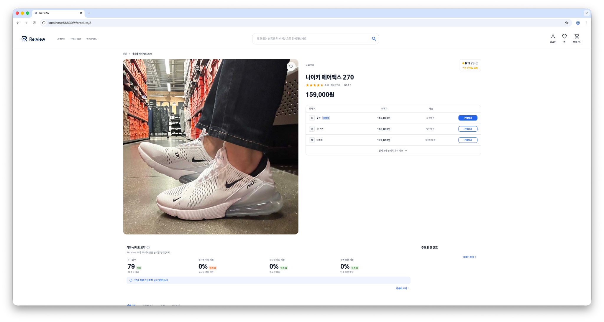

# Re:view

<p align="center">
  <b>실사용 리뷰 기반 쇼핑 신뢰도 분석 서비스</b><br/>
  상품 검색부터 리뷰 신뢰도 확인, 가격 비교, 관심 상품 관리까지 하나의 흐름으로 설계한 Flutter 애플리케이션
</p>

<p align="center">
  
  
  
  
  
  
</p>

<br/>

<table>
  <tr>
    <td colspan="2" align="center">
      <br/>
      <b>Home</b><br/>
      리뷰 기반 추천 상품과 카테고리 탐색
    </td>
  </tr>
  <tr>
    <td align="center" width="50%">
      <br/>
      <b>Search Results</b><br/>
      RTI, 가격, 리뷰 조건 기반 상품 비교
    </td>
    <td align="center" width="50%">
      <br/>
      <b>Product Detail</b><br/>
      리뷰 신뢰도 요약과 판매처별 가격 정보 제공
    </td>
  </tr>
</table>

---

## Overview

Re:view는 사용자가 온라인 쇼핑 과정에서 광고성 리뷰와 실제 구매 후기를 구분하고, 더 신뢰도 높은 상품을 선택할 수 있도록 돕는 리뷰 신뢰도 분석 서비스입니다.<br/>
단순 상품 목록이 아니라 `검색 → 필터링 → 상품 비교 → 상세 분석 → 찜/장바구니 관리`로 이어지는 구매 의사결정 흐름을 제품 수준으로 구현하는 데 집중했습니다.

Flutter 기반으로 구현해 **Web, Android, iOS**에서 동일한 핵심 경험을 제공할 수 있도록 구성했습니다.

## Problem

기존 쇼핑 경험은 아래 한계가 있습니다.

- 리뷰 수와 별점만으로는 실제 구매자의 신뢰도 높은 후기를 판단하기 어려움
- 여러 판매처의 가격, 배송, 리뷰 정보를 한 번에 비교하기 번거로움
- 광고성 리뷰나 반복 표현이 많은 상품을 사용자가 직접 걸러내야 함
- 관심 상품의 리뷰 신뢰도와 가격 변화를 지속적으로 추적하기 어려움

## Solution

이 문제를 해결하기 위해 아래 흐름으로 서비스를 설계했습니다.

- 상품명 또는 카테고리 기반 검색
- RTI(Re:view Trust Index), 가격대, 배송, 리뷰 조건 필터 제공
- 실사용 리뷰 기반 상품 카드와 비교 배너 제공
- 상품 상세에서 리뷰 신뢰도 요약, 위험 신호, 판매처별 가격 정보 제공
- 로그인 사용자 기준 찜, 장바구니, 마이페이지 흐름 지원

RTI는 실제 구매자 리뷰의 신뢰도를 종합해 산출한 지표로, 사용자가 리뷰 품질을 빠르게 판단할 수 있도록 상품 목록과 상세 화면 전반에 노출됩니다.

## Platform Support

| Platform | Support |
| --- | --- |
| Web | 넓은 화면에서 검색 필터, 상품 카드, 가격 비교 정보를 밀도 있게 제공 |
| Android | 모바일 터치 인터랙션과 반응형 상품 탐색 흐름 지원 |
| iOS | 모바일 레이아웃과 한글 입력 환경을 고려한 사용 경험 지원 |

## Core Features

- 리뷰 기반 홈 대시보드와 추천 상품 섹션
- 인기 검색어, 최근 검색어, 연관 검색어 기반 검색 진입
- 카테고리 및 키워드 기반 상품 검색
- RTI, 가격대, 배송, 판매처, 리뷰 조건 필터링
- 상품 카드 내 찜과 장바구니 액션
- 상품 상세 이미지 갤러리, 가격 비교, 리뷰 신뢰도 요약
- 네이버/Google OAuth를 포함한 로그인 및 회원가입 흐름
- 온보딩 기반 관심 카테고리 설정
- 찜 목록, 장바구니, 마이페이지 관리

## UI/UX

| Feature | Description |
| --- | --- |
| Home Dashboard | 배너, 카테고리, 인기 키워드, 추천 상품을 한 화면에서 탐색할 수 있도록 구성 |
| Search Experience | 검색어 입력, 자동완성, 최근/인기 검색어를 통해 빠르게 상품 탐색으로 연결 |
| Filtered Comparison | 좌측 필터와 정렬 옵션으로 가격, 리뷰 수, RTI 기준 비교를 지원 |
| Product Cards | 이미지, 브랜드, 가격, 별점, 리뷰 수, RTI 정보를 카드 안에서 즉시 확인 |
| Product Detail | 대표 이미지, 판매처별 가격, 리뷰 신뢰도 요약을 상세 화면에서 제공 |
| Auth Flow | 로그인 상태에 따라 찜, 장바구니, 마이페이지 접근을 자연스럽게 제어 |

## Tech Stack

| Layer | Stack |
| --- | --- |
| Frontend | `Flutter`, `Dart` |
| State Management | `flutter_riverpod`, `riverpod_annotation` |
| Routing | `go_router` |
| Networking | `Dio` |
| Data Modeling | `freezed`, `json_serializable` |
| UI Utility | `flutter_typeahead`, `shimmer`, `url_launcher` |
| Architecture | `Feature-based Clean Architecture` |
| Target Platforms | `Web`, `Android`, `iOS` |
| Testing | `flutter_test`, `mocktail` |

```text
lib/
├── app/
│   ├── responsive/
│   ├── router/
│   └── theme/
├── core/
│   ├── config/
│   ├── network/
│   ├── providers/
│   └── result/
├── features/
│   ├── auth/
│   ├── cart/
│   ├── home/
│   ├── landing/
│   ├── my_page/
│   ├── onboarding/
│   ├── product_detail/
│   ├── search/
│   └── wishlist/
└── shared/
    ├── constants/
    ├── extensions/
    └── widgets/
```

## Technical Highlights

| Area | Decision | Impact |
| --- | --- | --- |
| State Management | 기능별 ViewModel과 Riverpod provider 분리 | 화면 상태, 비즈니스 흐름, 의존성 주입을 feature 단위로 관리 |
| Routing | `GoRouter`와 로그인 상태 기반 redirect 구성 | 인증이 필요한 찜, 장바구니, 마이페이지 접근을 일관되게 제어 |
| Domain Design | 검색, 상품 상세, 찜, 장바구니, 인증 기능을 UseCase 중심으로 분리 | UI 코드와 비즈니스 로직 결합도 감소 |
| Network Config | 환경 변수 기반 API path와 기본 API base URL 구성 | 로컬, 배포 환경에서 API 연결 설정을 유연하게 조정 |
| Result Handling | `Result`, `Failure`, Dio 오류 변환 계층 구성 | 네트워크 실패와 사용자 표시 메시지를 일관되게 처리 |
| Search UX | 자동완성, 최근 검색, 인기 검색, 필터, 정렬을 하나의 검색 흐름으로 연결 | 사용자가 상품 탐색을 중단하지 않고 조건을 좁혀갈 수 있음 |
| Responsive UI | 데스크톱과 모바일 화면 폭에 따라 카드, 필터, 헤더 레이아웃 조정 | Web과 모바일 환경에서 모두 자연스럽게 읽히는 UI 제공 |

## Troubleshooting

| Issue | Approach | Result |
| --- | --- | --- |
| 로그인 상태에 따른 페이지 접근 제어 | `isLoggedInProvider`를 감시하는 router refresh notifier 구성 | 인증 페이지와 보호 페이지 간 redirect 흐름 안정화 |
| 검색 결과 카드의 반응형 레이아웃 | 화면 폭에 따라 카드 밀도와 이미지 비율을 조정 | 데스크톱 목록과 모바일 목록에서 정보가 잘리지 않도록 개선 |
| 상품 이미지 로딩 실패 | 공통 네트워크 이미지 위젯에서 placeholder와 error 상태 처리 | 외부 이미지 실패 시에도 화면 구조 유지 |
| 찜/장바구니 상태 동기화 | 상품 ID 기반 provider와 목록 snapshot invalidation 적용 | 카드, 상세, 목록 화면 사이의 저장 상태 일관성 확보 |
| API 오류 처리 | Dio 예외를 공통 failure 모델로 변환 | 실패 상황에서 재시도와 안내 메시지를 안정적으로 제공 |

## Testing

핵심 쇼핑 흐름과 공통 UI 안정성을 위해 feature 및 widget 단위 테스트를 작성했습니다.

- 인증 UseCase와 로그인/회원가입 ViewModel 상태 전이
- 홈 대시보드 UseCase와 홈 화면 렌더링
- 온보딩 완료 후 홈 진입 흐름
- 검색 결과 페이지 라우팅과 상품 카드 상호작용
- 상품 상세 이미지 갤러리와 RTI 요약 카드
- 찜/장바구니 provider 상태 동기화
- 공통 버튼, 입력 필드, 상태 뷰, 반응형 레이아웃

## Roadmap

- 리뷰 신뢰도 분석 기준과 설명 UI 고도화
- 상품 상세 리뷰 인사이트 영역 확장
- 개인화 추천과 관심 카테고리 기반 홈 구성 강화
- 찜 상품의 가격/RTI 변화 추적 기능 확대
- 검색 필터와 정렬 조건의 테스트 범위 확대
- 모바일 브라우저 및 앱 빌드 QA 강화

## Running Locally

```bash
flutter pub get
flutter run
```

웹 실행 시 API 주소를 직접 지정하려면 아래처럼 `--dart-define`을 함께 전달할 수 있습니다.

```bash
flutter run -d chrome --dart-define=API_BASE_URL=https://api.beens.kr
```
